# DivJS

**DIV Games Studio, back in the browser.** Write games in the DIV language -
processes, `FRAME`, `TYPE`, signals, all of it - and run them at 60 fps in
any modern browser, with physics, sound, music and online multiplayer on
top.

It started for fun: one weekend I began porting an old DIV-style virtual
machine of mine to JavaScript, just to see if it would fly in a browser. I
didn't expect it to run this well.

[](https://buymeacoffee.com/akadjoker)

This repository is the engine. **[▶ The playground](https://akadjoker.github.io/divjs-playground/)** - the online
editor with over 30 games to play and change - lives in
[divjs-playground](https://github.com/akadjoker/divjs-playground).

<table>
  <tr>
    <td align="center" width="50%"><a href="https://akadjoker.github.io/divjs-playground/playground/#p=fighter">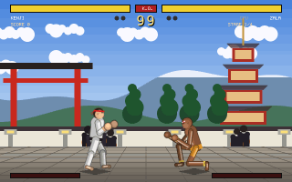</a><br><b>Street Duel</b><br>one-on-one fighter, specials and supers</td>
    <td align="center" width="50%"><a href="https://akadjoker.github.io/divjs-playground/playground/#p=bomber">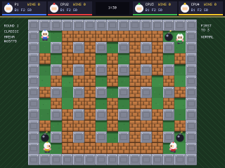</a><br><b>Bomber Arena</b><br>bombs, chain reactions, CPU rivals</td>
  </tr>
  <tr>
    <td align="center" width="50%"><a href="https://akadjoker.github.io/divjs-playground/playground/#p=strike"></a><br><b>Dune Strike</b><br>helicopter campaign in a generated desert</td>
    <td align="center" width="50%"><a href="https://akadjoker.github.io/divjs-playground/playground/#p=bad-cat"></a><br><b>Bad Cat</b><br>knock it all off the shelves, don't get caught</td>
  </tr>
  <tr>
    <td align="center" width="50%"><a href="https://akadjoker.github.io/divjs-playground/playground/#p=chicken-cannon"></a><br><b>Chicken Cannon</b><br>physics artillery, with chickens</td>
    <td align="center" width="50%"><a href="https://akadjoker.github.io/divjs-playground/playground/#p=ghost-squad"></a><br><b>Ghost Squad</b><br>Pac-Man, but you are the ghosts</td>
  </tr>
  <tr>
    <td align="center" width="50%"><a href="https://akadjoker.github.io/divjs-playground/playground/#p=wobbly-walker">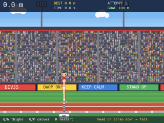</a><br><b>Wobbly Walker</b><br>QWOP-style ragdoll running</td>
    <td align="center" width="50%"><a href="https://akadjoker.github.io/divjs-playground/playground/#p=net-tanks"></a><br><b>Net Tanks</b><br>two players, online, no server</td>
  </tr>
  <tr>
    <td align="center" width="50%"><a href="https://akadjoker.github.io/divjs-playground/playground/#p=racer">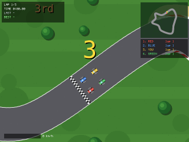</a><br><b>Micro racer</b><br>top-down racing on generated tracks</td>
    <td align="center" width="50%"><a href="https://akadjoker.github.io/divjs-playground/playground/#p=vector-asteroids">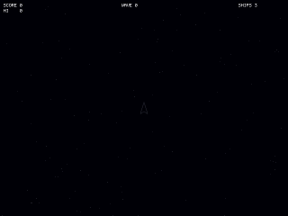</a><br><b>Vector Asteroids</b><br>every rock drawn in code</td>
  </tr>
</table>

## All the programs

62 programs to play, read and change. Open a group and click a picture to run that program in the playground.

<details>
<summary><b>Start here</b> (3)</summary>

<table>
  <tr>
    <td align="center" width="33%"><a href="https://akadjoker.github.io/divjs-playground/playground/#p=start1-player">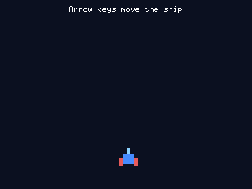</a><br><b>Step 1: the player</b></td>
    <td align="center" width="33%"><a href="https://akadjoker.github.io/divjs-playground/playground/#p=start2-shots">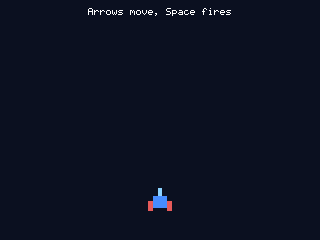</a><br><b>Step 2: shooting</b></td>
    <td align="center" width="33%"><a href="https://akadjoker.github.io/divjs-playground/playground/#p=start3-enemies">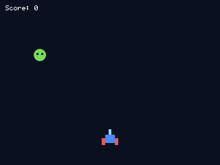</a><br><b>Step 3: enemies</b></td>
  </tr>
</table>

</details>

<details>
<summary><b>DIV tutorials</b> (9)</summary>

<table>
  <tr>
    <td align="center" width="33%"><a href="https://akadjoker.github.io/divjs-playground/playground/#p=tutor0a">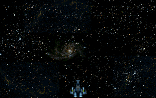</a><br><b>Tutorial 0a: ship and shots</b></td>
    <td align="center" width="33%"><a href="https://akadjoker.github.io/divjs-playground/playground/#p=tutor0b">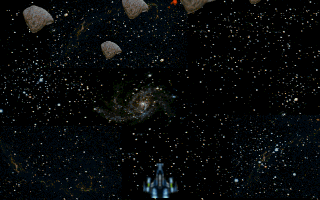</a><br><b>Tutorial 0b: enemies</b></td>
    <td align="center" width="33%"><a href="https://akadjoker.github.io/divjs-playground/playground/#p=tutor1a">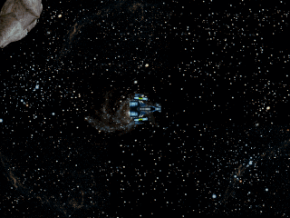</a><br><b>Tutorial 1a: asteroids</b></td>
  </tr>
  <tr>
    <td align="center" width="33%"><a href="https://akadjoker.github.io/divjs-playground/playground/#p=tutor1b">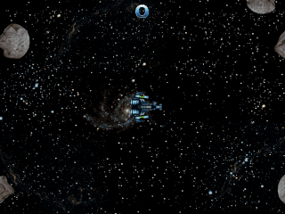</a><br><b>Tutorial 1b: asteroids with score</b></td>
    <td align="center" width="33%"><a href="https://akadjoker.github.io/divjs-playground/playground/#p=tutor2">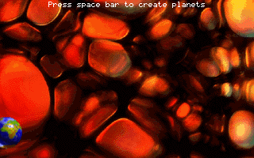</a><br><b>Tutorial 2: planets</b></td>
    <td align="center" width="33%"><a href="https://akadjoker.github.io/divjs-playground/playground/#p=tutor3">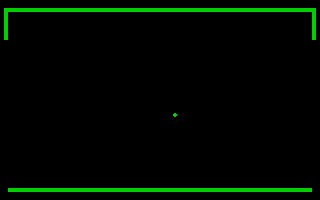</a><br><b>Tutorial 3: pong</b></td>
  </tr>
  <tr>
    <td align="center" width="33%"><a href="https://akadjoker.github.io/divjs-playground/playground/#p=tutor4">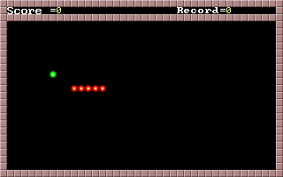</a><br><b>Tutorial 4: worm</b></td>
    <td align="center" width="33%"><a href="https://akadjoker.github.io/divjs-playground/playground/#p=tutor5">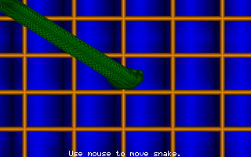</a><br><b>Tutorial 5: snake</b></td>
    <td align="center" width="33%"><a href="https://akadjoker.github.io/divjs-playground/playground/#p=tutor6">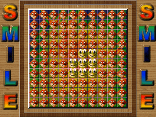</a><br><b>Tutorial 6: smile</b></td>
  </tr>
</table>

</details>

<details>
<summary><b>Examples</b> (4)</summary>

<table>
  <tr>
    <td align="center" width="33%"><a href="https://akadjoker.github.io/divjs-playground/playground/#p=platformer-basic"></a><br><b>Basic platformer</b></td>
    <td align="center" width="33%"><a href="https://akadjoker.github.io/divjs-playground/playground/#p=frame-timing">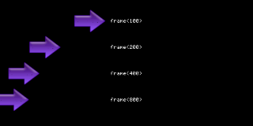</a><br><b>FRAME(n) timing</b></td>
    <td align="center" width="33%"><a href="https://akadjoker.github.io/divjs-playground/playground/#p=scroll">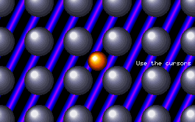</a><br><b>Scroll window</b></td>
  </tr>
  <tr>
    <td align="center" width="33%"><a href="https://akadjoker.github.io/divjs-playground/playground/#p=sound-lab">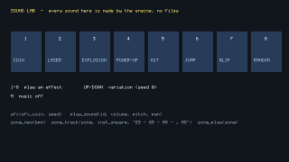</a><br><b>Sound Lab: effects and music</b></td>
    <td></td>
    <td></td>
  </tr>
</table>

</details>

<details>
<summary><b>Demos</b> (6)</summary>

<table>
  <tr>
    <td align="center" width="33%"><a href="https://akadjoker.github.io/divjs-playground/playground/#p=breakout">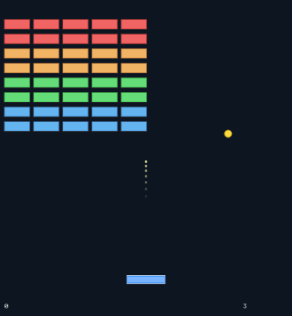</a><br><b>Breakout</b></td>
    <td align="center" width="33%"><a href="https://akadjoker.github.io/divjs-playground/playground/#p=platformer">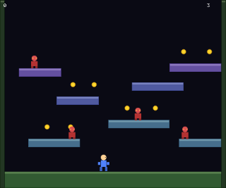</a><br><b>Platformer</b></td>
    <td align="center" width="33%"><a href="https://akadjoker.github.io/divjs-playground/playground/#p=shmup">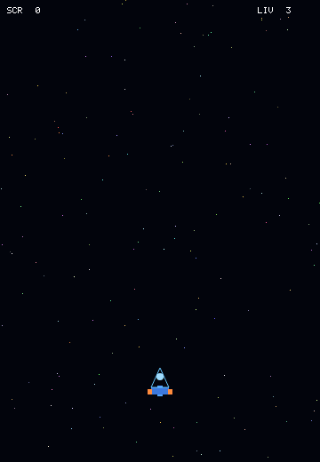</a><br><b>Space shooter</b></td>
  </tr>
  <tr>
    <td align="center" width="33%"><a href="https://akadjoker.github.io/divjs-playground/playground/#p=bunnymark">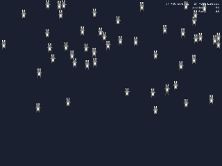</a><br><b>Bunnymark</b></td>
    <td align="center" width="33%"><a href="https://akadjoker.github.io/divjs-playground/playground/#p=pathfind">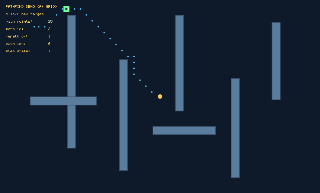</a><br><b>Pathfinding</b></td>
    <td align="center" width="33%"><a href="https://akadjoker.github.io/divjs-playground/playground/#p=fpg-fnt-game">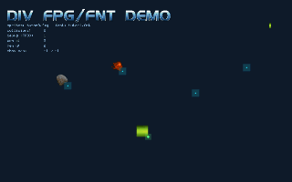</a><br><b>FPG and FNT assets</b></td>
  </tr>
</table>

</details>

<details>
<summary><b>Procedural games</b> (28)</summary>

<table>
  <tr>
    <td align="center" width="33%"><a href="https://akadjoker.github.io/divjs-playground/playground/#p=maze">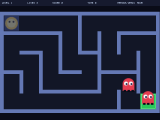</a><br><b>Maze Runner</b></td>
    <td align="center" width="33%"><a href="https://akadjoker.github.io/divjs-playground/playground/#p=vector-asteroids"></a><br><b>Vector Asteroids</b></td>
    <td align="center" width="33%"><a href="https://akadjoker.github.io/divjs-playground/playground/#p=invaders">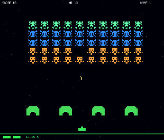</a><br><b>Procedural Invaders</b></td>
  </tr>
  <tr>
    <td align="center" width="33%"><a href="https://akadjoker.github.io/divjs-playground/playground/#p=cave-flyer">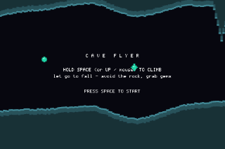</a><br><b>Cave Flyer</b></td>
    <td align="center" width="33%"><a href="https://akadjoker.github.io/divjs-playground/playground/#p=dungeon">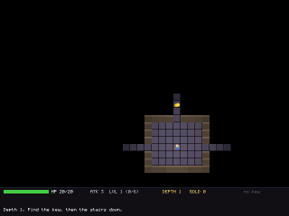</a><br><b>Deep Delve</b></td>
    <td align="center" width="33%"><a href="https://akadjoker.github.io/divjs-playground/playground/#p=rts">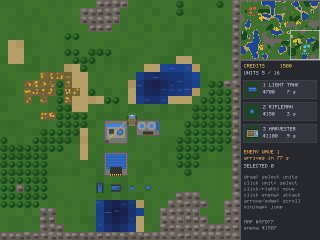</a><br><b>Red Ore (RTS)</b></td>
  </tr>
  <tr>
    <td align="center" width="33%"><a href="https://akadjoker.github.io/divjs-playground/playground/#p=artillery">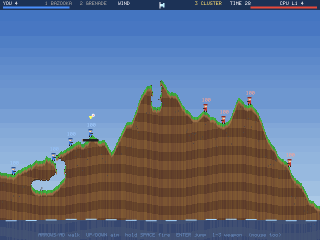</a><br><b>Artillery (Worms)</b></td>
    <td align="center" width="33%"><a href="https://akadjoker.github.io/divjs-playground/playground/#p=tower-defense">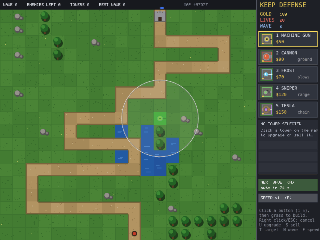</a><br><b>Keep Defense</b></td>
    <td align="center" width="33%"><a href="https://akadjoker.github.io/divjs-playground/playground/#p=colony">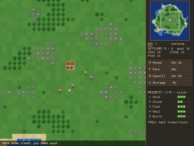</a><br><b>Isle of Settlers</b></td>
  </tr>
  <tr>
    <td align="center" width="33%"><a href="https://akadjoker.github.io/divjs-playground/playground/#p=racer"></a><br><b>Pocket GP (racing)</b></td>
    <td align="center" width="33%"><a href="https://akadjoker.github.io/divjs-playground/playground/#p=lemmings">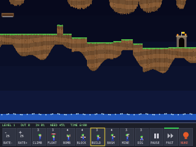</a><br><b>Burrowers (Lemmings)</b></td>
    <td align="center" width="33%"><a href="https://akadjoker.github.io/divjs-playground/playground/#p=raptor">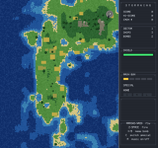</a><br><b>Stormwing (shoot'em up)</b></td>
  </tr>
  <tr>
    <td align="center" width="33%"><a href="https://akadjoker.github.io/divjs-playground/playground/#p=sandbox">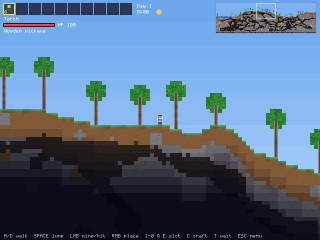</a><br><b>TerraDIV (sandbox)</b></td>
    <td align="center" width="33%"><a href="https://akadjoker.github.io/divjs-playground/playground/#p=tetris">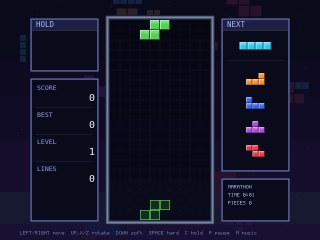</a><br><b>Tetris</b></td>
    <td align="center" width="33%"><a href="https://akadjoker.github.io/divjs-playground/playground/#p=aquarium">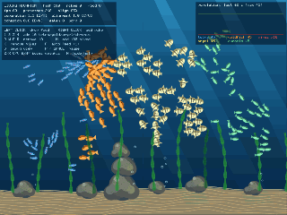</a><br><b>Living Aquarium (boids)</b></td>
  </tr>
  <tr>
    <td align="center" width="33%"><a href="https://akadjoker.github.io/divjs-playground/playground/#p=match3">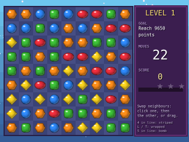</a><br><b>Sugar Swap (match-3)</b></td>
    <td align="center" width="33%"><a href="https://akadjoker.github.io/divjs-playground/playground/#p=arkanoid">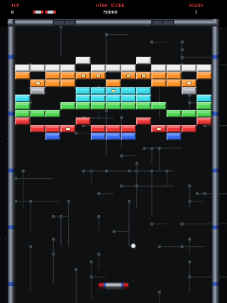</a><br><b>Arkanoid</b></td>
    <td align="center" width="33%"><a href="https://akadjoker.github.io/divjs-playground/playground/#p=bubbles">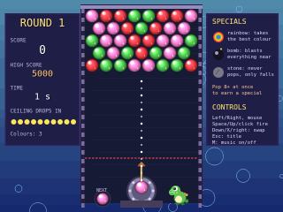</a><br><b>Bubble Dino (Puzzle Bobble)</b></td>
  </tr>
  <tr>
    <td align="center" width="33%"><a href="https://akadjoker.github.io/divjs-playground/playground/#p=karate">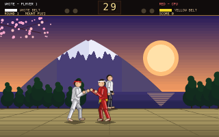</a><br><b>Karate-Do (International Karate)</b></td>
    <td align="center" width="33%"><a href="https://akadjoker.github.io/divjs-playground/playground/#p=fighter"></a><br><b>Street Duel (Street Fighter style)</b></td>
    <td align="center" width="33%"><a href="https://akadjoker.github.io/divjs-playground/playground/#p=bomber"></a><br><b>Bomber Arena (Bomberman)</b></td>
  </tr>
  <tr>
    <td align="center" width="33%"><a href="https://akadjoker.github.io/divjs-playground/playground/#p=brawler">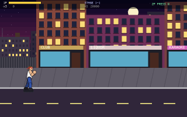</a><br><b>Neon Fists (beat 'em up)</b></td>
    <td align="center" width="33%"><a href="https://akadjoker.github.io/divjs-playground/playground/#p=strike"></a><br><b>Dune Strike (Desert Strike)</b></td>
    <td align="center" width="33%"><a href="https://akadjoker.github.io/divjs-playground/playground/#p=ghost-squad"></a><br><b>Ghost Squad</b></td>
  </tr>
  <tr>
    <td align="center" width="33%"><a href="https://akadjoker.github.io/divjs-playground/playground/#p=sparkroll">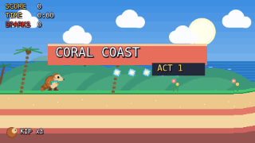</a><br><b>Sparkroll</b></td>
    <td align="center" width="33%"><a href="https://akadjoker.github.io/divjs-playground/playground/#p=rusty-leap">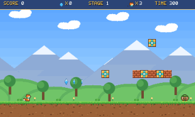</a><br><b>Rusty Leap</b></td>
    <td align="center" width="33%"><a href="https://akadjoker.github.io/divjs-playground/playground/#p=sky-shield">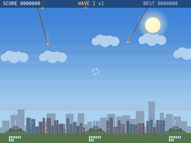</a><br><b>Sky Shield</b></td>
  </tr>
  <tr>
    <td align="center" width="33%"><a href="https://akadjoker.github.io/divjs-playground/playground/#p=beat-bash">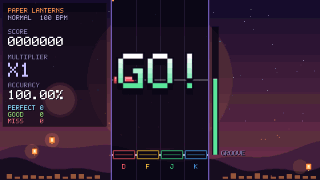</a><br><b>Beat Bash</b></td>
    <td></td>
    <td></td>
  </tr>
</table>

</details>

<details>
<summary><b>Physics</b> (8)</summary>

<table>
  <tr>
    <td align="center" width="33%"><a href="https://akadjoker.github.io/divjs-playground/playground/#p=physics-sandbox">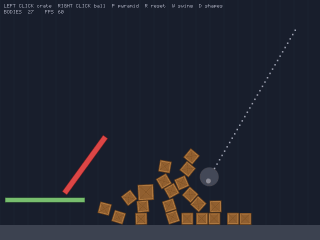</a><br><b>Physics sandbox</b></td>
    <td align="center" width="33%"><a href="https://akadjoker.github.io/divjs-playground/playground/#p=slingshot">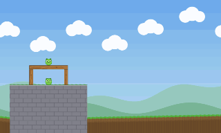</a><br><b>Slingshot (Angry Birds)</b></td>
    <td align="center" width="33%"><a href="https://akadjoker.github.io/divjs-playground/playground/#p=physics-lab"></a><br><b>Physics lab</b></td>
  </tr>
  <tr>
    <td align="center" width="33%"><a href="https://akadjoker.github.io/divjs-playground/playground/#p=hillclimb"></a><br><b>Hill Climb</b></td>
    <td align="center" width="33%"><a href="https://akadjoker.github.io/divjs-playground/playground/#p=pinball"></a><br><b>Procedural Pinball</b></td>
    <td align="center" width="33%"><a href="https://akadjoker.github.io/divjs-playground/playground/#p=bad-cat"></a><br><b>Bad Cat</b></td>
  </tr>
  <tr>
    <td align="center" width="33%"><a href="https://akadjoker.github.io/divjs-playground/playground/#p=chicken-cannon"></a><br><b>Chicken Cannon</b></td>
    <td align="center" width="33%"><a href="https://akadjoker.github.io/divjs-playground/playground/#p=wobbly-walker"></a><br><b>Wobbly Walker</b></td>
    <td></td>
  </tr>
</table>

</details>

<details>
<summary><b>Online</b> (1)</summary>

<table>
  <tr>
    <td align="center" width="33%"><a href="https://akadjoker.github.io/divjs-playground/playground/#p=net-tanks"></a><br><b>Net Tanks (online, 2 players)</b></td>
    <td></td>
    <td></td>
  </tr>
</table>

</details>

<details>
<summary><b>For small children</b> (1)</summary>

<table>
  <tr>
    <td align="center" width="33%"><a href="https://akadjoker.github.io/divjs-playground/playground/#p=balloon-pop"></a><br><b>Balloon Pop</b></td>
    <td></td>
    <td></td>
  </tr>
</table>

</details>

<details>
<summary><b>Pixel art games</b> (2)</summary>

<table>
  <tr>
    <td align="center" width="33%"><a href="https://akadjoker.github.io/divjs-playground/playground/#p=keyhole-hop"></a><br><b>Keyhole Hop</b></td>
    <td align="center" width="33%"><a href="https://akadjoker.github.io/divjs-playground/playground/#p=ember-keep"></a><br><b>Keep of Embers</b></td>
    <td></td>
  </tr>
</table>

</details>

## Why this exists

DIV Games Studio was how a lot of us made our first games in the late '90s:
a small language where every enemy, bullet and explosion is a *process*
that runs its own loop and calls `FRAME` when it's done for the frame.
I'd written a DIV-style virtual machine in C++ years ago, and one weekend I
started porting it to JavaScript just to see if it would fly in a browser.
It did - and it kept growing.

DivJS is that port: a tokenizer, parser, bytecode compiler and virtual
machine with DIV's cooperative processes, rendering to a Canvas 2D. The DIV
tutorials run on it, and on top of what DIV had it adds the things you'd
want today - rigid-body physics, synthesised sound and music, and
peer-to-peer online play.

## The games are the test

The games in the playground are built only from the language and the
reference in [docs/natives.md](docs/natives.md) - the same material you
have. Each one was played in a real browser with real key presses, checked
for warnings and frame drops, and fixed until it held 60 fps.

That's the point of showing them: if a Street Fighter clone, a Bomberman
with CPU players that plan their escapes, or a cat that knocks vases off
shelves can be built from that reference, the engine and its docs are
doing their job - and you can build them too. Every engine feature has
tests.

## A taste of DIV

```div
PROGRAM hello;

PROCESS ship();
BEGIN
  graph = new_graphic(16, 16);
  gfx_fill(graph, 90, 200, 255);
  x = 160; y = 100;
  LOOP
    IF (key(_left))  x = x - 3; END
    IF (key(_right)) x = x + 3; END
    IF (key_pressed(_space)) play_sound(sfx(sfx_laser)); END
    FRAME;
  END
END

BEGIN
  set_mode(320, 200);
  set_fps(60, 0);
  ship();
  LOOP FRAME; END
END
```

Every process runs until its `FRAME`, the engine draws it, and the next
frame picks up where it left off. That's the whole trick, and it scales
from this to a 3000-line fighting game.

## What's in the box

- **The DIV language** - processes, `FRAME(n)`, `TYPE`, `signal`, `collision`,
  `LOCAL`/`PRIVATE`/`GLOBAL`, `STRUCT`s, `OFFSET` and scroll windows.
- **DIV files** - `load_fpg`, `load_map`, `load_fnt` read the original
  formats; PNGs and BDF fonts work too.
- **Physics** - Box2D (via Planck.js) behind a handful of `phys_*` calls: a
  process gets a body and the world moves it, in pixels and DIV angles.
  Joints, motors, ropes, impacts, raycasts.
- **Sound and music, no files needed** - `sfx(sfx_coin)`, `sfx(sfx_explosion, seed)`
  synthesise classic game effects; songs are written as lines of notes
  (`"E5 - G5 - A5 - . A5"`, drums as `"k . h . s . h ."`). WAV/OGG/MP3 load
  too, and DIV's `sound()` family is there.
- **Online multiplayer without a server** - two browsers connect peer to
  peer (WebRTC) by swapping an invitation link and an answer code. Games
  either send messages or run in lockstep, where only the players' keys
  travel.
- **Pathfinding, paths, maths helpers**, a debug overlay, and more - every
  function is in [docs/natives.md](docs/natives.md).

## Using the engine

The whole engine is one ES module, `dist/divjs.js` (or `dist/divjs.min.js`),
with no dependencies:

```js
import { runDivDemo } from './divjs.js';

const game = runDivDemo({
  canvas: 'gameCanvas',
  source: `program demo; begin loop frame; end end`
});
```

Get it from this repository's `dist/` folder, or install a version with npm
(pinned to a tag):

```bash
npm install github:akadjoker/divjs#v1.0.0
# node_modules/divjs/dist/divjs.js
```

`runDivDemo` compiles the program and runs it with input, sound and the
game loop wired up. It returns `{ start, stop, destroy, setSource, setFiles,
setNetInvite, getState }`; `start(source)` can be called again and again on
the same canvas (an editor's Run button). Useful options:

- `files` - `{ name: Blob | ArrayBuffer | Uint8Array | url }`, looked up by
  `load_*` before any URL.
- `virtualWidth` / `virtualHeight` - render at a fixed resolution and scale
  it onto the canvas.
- `onLog`, `onError`, `onFrame` - hooks; compile errors come as `DivError`
  with `line`, `col` and `reason`.
- `netIceServers`, `netInviteLink` - online play settings.

The module also exports the pieces underneath - `compile(source)`, `VM`,
`CanvasEngineRuntime`, `Lexer`, `Parser`, `Compiler`, the DIV file readers
and the packer - for tools and editors. Every function a DIV program can
call is in [docs/natives.md](docs/natives.md).

To ship a game as a single `.html` file (engine, code and files inside,
works offline):

```bash
npm run pack -- mygame.div -o mygame.html
```

## Online play notes

The browsers find each other through a public STUN server
(`stun.l.google.com` by default, set your own with `netIceServers`), which
only tells each browser its public address - no game data goes through it.
Behind some routers (symmetric NAT, common on mobile networks) a TURN relay
is needed. Two players for now.

## Working on the engine

```bash
npm install
npm run build                      # dist/divjs.js from the sources
npm run test:pipeline              # compiles the test programs, checks the packer
npx playwright install chromium    # once
npm run test:browser               # the engine suite, the bundle, a packed game
```

```text
compiler/      bytecode, compiler, disassembler
parser/        parser
vm/            virtual machine, processes, runtime, physics, sound, net
index.js       the public entry point; dist/ is its build
tools/         packer (single-file games)
docs/          function reference
tests/         engine tests
```

## Credits

DivJS exists because of DIV Games Studio, the 1990s game-making tool it
reimplements; DIV 2's source is published under the GPL-3.0 at
[DIVGAMES/DIV-Games-Studio](https://github.com/DIVGAMES/DIV-Games-Studio).
DivJS is an independent reimplementation and doesn't contain DIV's code.
BennuGD was a big influence too.

## Support

DivJS is free and always will be. If it made you smile or saved you some
work, you can [buy me a coffee](https://buymeacoffee.com/akadjoker) - thank you!

## License

MIT - see [LICENSE](LICENSE). Planck.js (MIT) is bundled in; it and the test
files whose terms aren't confirmed yet are listed in
[THIRD_PARTY_NOTICES.md](THIRD_PARTY_NOTICES.md).
